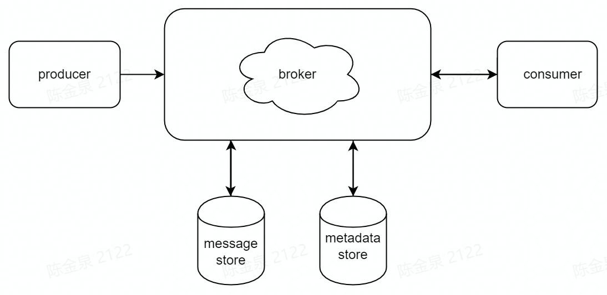
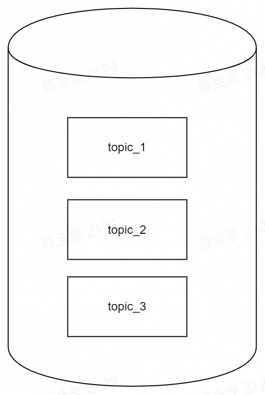
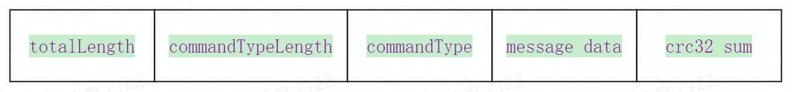
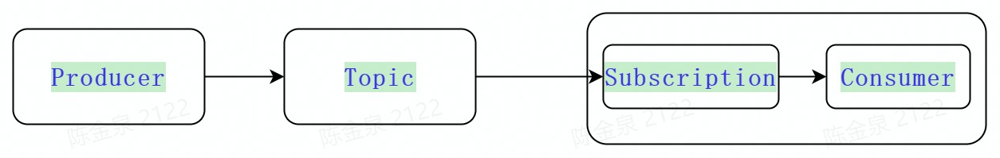
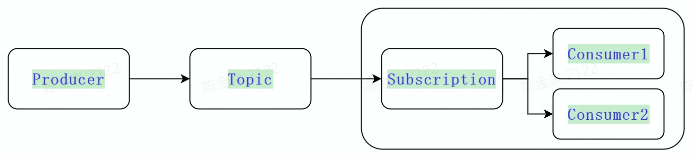

# 消息总线MQ

# 关键设计



消息总线MQ基于发布-订阅模型实现，由producer ,broker,consumer等组件组成，消息存储、元数据存储通过mysql数据库存储，消息一旦存储，不会删除，消费后只会更新消费的offset偏移量


### 消息存储

按照一个topic（patition）一个租户一个表存储



### 消息通信

#### 协议设计与编解码



消息传输内容主要可以分为以下5部分：

(1) 消息总长度：总长度，四个字节存储，占用一个int类型，总长度不包括自身占用的字节数，即总长度的值=(commandTypeLength+commandType+message data +crc32 sum)内容的长度之和；

(2) 命令类型长度：同样占用一个int类型

(3) 命令类型：命令类型数据；

(4) 消息主体数据：包括消息头消息主体的二进制字节数据内容；

(5)crc32：crc32校验和

### 消息过滤

#### 服务端消息过滤

服务端支持消息tag过滤，topic类型是默认类型，消息tag过滤根据生产者在发送消息时，指定消息的Tag，消费者需根据已经指定的Tag来进行订阅。消费者订阅 Topic 时若未设置 Tag，Topic 中的所有消息都将被投递到消费端进行消费。

##### 使用说明

生产者发送消息指定tag

- 在 生产者发送消息时， 设置消息的 Properties 字段，其中 key 为 tag 的名字，value 为固定值：`TAGS`。

```Python
MessageId sss = producer.newMessage()
        .property("tagTest","TAGS")
        .value("producer:test")
        .send()
        ;
```

消费者订阅 SubscriptionProperties 字段指定tag消费，其中 key 为要订阅的 tag 的名字，value字段保留，兼容binlog的消息过滤

```PHP
final Consumer<String> consumer = mqclient.newConsumer()
        .consumerName("consumer1")
        .subscriptionName("consumer_push")
        .topic("test2")
        .subscriptionType(SubscriptionType.Shared)
        .ackTimeOut(10, TimeUnit.SECONDS)
        .messageListener(new PushMessageListener())
        .subscriptionProperty("tagTest","v1")
        .subscribe();
```

##### binlog消息过滤

消费者订阅topic类型为*Binlog*时，SubscriptionProperties 当前支持tag设置table_name和event_type，value字段为对应的表名和事件类型。

```Kotlin
final val consumer = mqClient
        .newConsumer(BinLogStoreEntity.class)
        .ackTimeOut(10, TimeUnit.SECONDS)
        .topic("rs_dev")
        .consumerName("data-processing")
        .subscriptionName("binlog_restore")
        .topicType(TopicType.Binlog)
        .subscriptionType(SubscriptionType.Direct)
        .tenantId(1)
        .messageListener(this)
        .subscriptionProperties(BinlogSubscriptionProperties
                .newSubscriptionProperties()
                .eventTypes(Arrays.asList("insert","update","delete"))
                .tableNames(Arrays.asList("dicts","slices"))
        )
        .subscribe()
        ;
```

#### 客户端消息过滤

当消费者使用broker push方式接收消息时，支持客户端消息函数回调过滤，在订阅时指定要过滤的

MessageFilter实现

```PHP
final Consumer<String> consumer = mqclient.newConsumer()
        .consumerName("consumer1")
        .subscriptionName("consumer_push")
        .topic("test")
        .subscriptionType(SubscriptionType.Shared)
        .ackTimeOut(10, TimeUnit.SECONDS)
        .messageFilter(message -> {
            //消息体内容是test时，才正常消费,否则消息被过滤，自动被ack
            return "test".equals(message.getValue());
        })
        .messageListener(new PushMessageListener())
        .subscribe();
```


### 负载均衡

当消费者使用broker push方式接收消息，订阅模式使用*Shared**模式*时，broker支持轮询负载推送到不同的消费者客户端


### 订阅模式

#### 直连模式

直连模式一个 Subscription 只能与一个 Consumer 关联，同一个 Subscription 里只有一个 Consumer 能消费 Topic，如果多个 Consumer 订阅则会报错，适用于全局有序消费的场景。



```PHP
final Consumer<String> consumer = mqclient.newConsumer()
        .consumerName("consumer1")
        .subscriptionName("consumer_push")
        .topic("test2")
        .subscriptionType(SubscriptionType.Direct)
        .subscribe();
```

#### 共享模式

共享模式一个 Subscription 能与多个 Consumer 关联，消息通过轮询机制分发给不同的消费者，并且每个消息仅会被分发给一个消费者。



```PHP
final Consumer<String> consumer = mqclient.newConsumer()
        .consumerName("consumer1")
        .subscriptionName("consumer_push")
        .topic("test2")
        .subscriptionType(SubscriptionType.Shared)
        .subscribe();
```


### 消息获取方式

#### pull模式

pull模式通过客户端主动拉取服务端消息，pull模式支持根据消息offset回溯消费。

消费者订阅时未设置消息监听器就是pull模式，设置了就是push模式

```Plain%20Text
final Consumer<String> consumer = mqclient.newConsumer()
        .consumerName("consumer1")
        .subscriptionName("consumer_push")
        .topic("test2")
        .subscriptionType(SubscriptionType.Shared)
        .subscribe();
```

#### push模式

push模式通过broker实时推消息至客户端，push模式不支持消息的回溯消费。

消费者订阅时设置消息监听器就是push模式

```PHP
final Consumer<String> consumer = mqclient.newConsumer()
        .consumerName("consumer1")
        .subscriptionName("consumer_push")
        .topic("test2")
        .subscriptionType(SubscriptionType.Direct)
        .messageListener(new PushMessageListener())
        .subscribe();
```

### 消息的可靠消费(At least once)

消费者通过pull模式拉取消息，消息的可靠消费由消费者自己保证

消费者通过push模式获取消息时，设置ackTimeOut属性，如果消费者在ackTimeOut时间后还未确认消费，broker会重新推送该消息，如果未设置，broker不会重新推送

```Plain%20Text
final Consumer<String> consumer = mqclient.newConsumer()
        .consumerName("consumer1")
        .subscriptionName("consumer_push")
        .topic("test2")
        .subscriptionType(SubscriptionType.Direct)
        //10s 后消息未ack,broker会重新推送消息
        .ackTimeOut(10, TimeUnit.SECONDS)
        .messageListener(new PushMessageListener())
        .subscribe();
```

### 顺序消费

当订阅模式使用直连模式时，能够保证一个订阅只会被一个消费者连接，消息只会被该消费者消费。

# 消息统计

暂无

# 消息追踪

暂无


# Mq client使用


### mq client创建

原则上一个进程一个**MqClient** **实例**

```Java
//创建mqClient实例
final MqClient mqclient = MqClient.builder()
        .authClientId("testclient")
        .listenerThreads(1)
        .serviceUrl("127.0.0.1:17000")
        .maxConnections(1)
        .build();
```

### 生产者

```Visual%20Basic
//创建生产者实例
final Producer<String> producer = mqclient.newProducer()
        .producerName("producer1")
        .sendTimeout(10, TimeUnit.SECONDS)
        .topic("test")
        .topicType(TopicType.Default)
        .tenantId(1)
        .create();
        
 //发送消息
MessageId sss = producer.newMessage()
        .property("tagTest","TAGS")
        .value("producer")
        .send()
        ;       
```

### 消费者

```PHP
final Consumer<String> consumer = mqclient.newConsumer()
        .consumerName("consumer1")
        .subscriptionName("consumer_push")
        //依赖的订阅名称，如果有设置，该订阅只能拉取依赖订阅ack后的数据
        .dependencyOnSubscription("dependencySubscription")
        .topic("test2")
        .topicType(TopicType.Default)
        .subscriptionType(SubscriptionType.Direct)
        //消息标签过滤tag设置，服务端过滤
        .subscriptionProperty("tagTest","v1")
        .ackTimeOut(10, TimeUnit.SECONDS)
        //消息过滤回调函数,此为客户端消息过滤，消息获取方式是push模式才有效
        .messageFilter(message -> {
            return true;
        })
        //设置了监听器就是push模式，不设置就是pull模式
        .messageListener(new PushMessageListener())        
        .subscribe();

static class PushMessageListener implements MessageListener<String>{

    @Override
    public void onMessage(Consumer consumer, Message<String> msg) {
        System.out.println("consumer_push 收到消息"+msg.getValue());
        try {
            consumer.ack(msg);
        } catch (MqClientException e) {
            e.printStackTrace();
        }
    }
} 
```